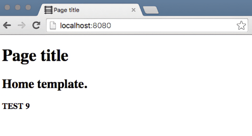
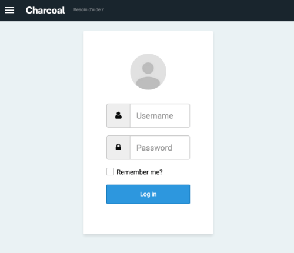

# Charcoal Project Boilerplate

A skeleton for creating Web sites with [Charcoal][charcoal/charcoal].

See below for an [overview](#overview) of this skeleton's structure and objectives.

## Installation

This skeleton is available on [Packagist][charcoal/boilerplate] and can be
installed using [Composer]:

```shell
composer create-project charcoal/boilerplate example-project
```

After the skeleton is installed, point the document root of your Web server
to the [`example-project/www`](www) directory.

By default, the skeleton includes an Apache [`.htaccess`](www/.htaccess) file.
See below for examples on [configuring your Web server](#server-configuration).

From the command line, PHP provides a [built-in Web server][PHP-CLI/webserver]
for quickly serving your project:

```shell
cd www
php -S localhost:8080
```

Visit `http://localhost:8080` in your browser to see the following:

<details>
<summary>Example: Skeleton's default index page</summary>



</details>

## Update

The skeleton does not provide any process for automated upgrades.
You will have to port any updates manually.

This is because the skeleton is a starting point for your project and its
various files are mainly present for demonstration and would otherwise be
removed or modified for your purposes.

## Application Configuration

Create a copy of the [`config/config.sample.json`](config/config.sample.json)
file and name it `config/config.local.json`. This is your environment specific
configuration file and it should be excluded from your project's source control
repository. Edit this file to configure services such as the database,
third-party services, logs, and caches.

Any other options relevant to your project should be changed in all other
files in the [`config`](config) directory.

### Database Configuration

If your project does not require any database storage, use a database in-memory
such as [SQLite] by adding the following to the `config/config.local.json` file:

```json
{
    "databases": {
        "default": {
            "type": "sqlite",
            "database": ":memory:"
        }
    },
    "default_database": "default"
}
```

If your project uses MySQL, create an empty database and ensure a SQL user
has the proper permissions for this database. Then add the following to the
`config/config.local.json` file:

```json
{
    "databases": {
        "default": {
            "type": "mysql",
            "hostname": "127.0.0.1",
            "database": "foobar",
            "username": "foo_bar",
            "password": "l337"
        }
    },
    "default_database": "default"
}
```

### Project Name

By default, the skeleton uses "Acme" as a dummy name. There are a few occurrences
throughout the repository that should be changed to reflect your project:

* [`config/admin.json`](config/admin.json): See `admin.title`.
* [`config/config.json`](config/config.json): See `project_name` and `cache.prefix`.

You should also change the details of the Composer dependency manifest:

* [`composer.json`](composer.json): See `name`.

### Administration Dashboard

A quick-and-dirty command line script is provided to install the assets
for the administration area:

```shell
./build/scripts/install-charcoal-admin.sh
```

Afterwards, visit `http://localhost:8080/admin/login` in your browser to see
the following:

<details>
<summary>Example: Charcoal's administration login page</summary>



</details>

The administration area can be customized from the
[`config/admin.json`](config/admin.json) file.

### Install Locomotive Boilerplate

Optionally, another quick-and-dirty script is provided to install the Locomotive's
[front-end development tools][locomotive/boilerplate]:

```shell
./build/scripts/install-locomotive-boilerplate.sh
```

For more information, visit Locomotive's [Boilerplate repository][locomotive/boilerplate].

## Server Requirements

* [PHP] >= 7.4
* PHP Extensions:
  * [JSON](https://www.php.net/manual/en/book.json.php)
  * [MBString](https://www.php.net/manual/en/book.mbstring.php)
  * [PDO](https://www.php.net/manual/en/book.pdo.php)
  * [SPL](https://www.php.net/manual/en/book.spl.php)

## Server Configuration

### Apache Configuration

Use the following configuration as a starting point for configuring
the [Apache HTTP server](https://httpd.apache.org/). Note that this
should be used instead of the skeleton's `.htaccess` file.

> Note that you should replace `path/to/example-project/www` with the actual
> path for `example-project/www`.

<details>
<summary>Example: Apache configuration</summary>

```apache
# Set document root to be "example-project/www"
DocumentRoot "path/to/example-project/www"

<Directory "path/to/example-project/www">
    <IfModule mod_rewrite.c>
        RewriteEngine on

        # If a directory or a file does not exist,
        # forward the request to the application controller
        RewriteCond %{REQUEST_FILENAME} !-d
        RewriteCond %{REQUEST_FILENAME} !-f
        RewriteRule ^ index.php
    </IfModule>
</Directory>
```

</details>

### Nginx Configuration

Use the following configuration as a starting point for configuring
the [Nginx HTTP server](https://nginx.org/).

> Note that you should replace `path/to/example-project/www` with the actual
> path for `example-project/www`.

<details>
<summary>Example: Nginx configuration</summary>

```nginx
server {
    listen 80;
    listen [::]:80;

    server_name example-project.test;
    root        /path/to/example-project/www;
    access_log  /path/to/example-project/logs/access.log;
    error_log   /path/to/example-project/logs/error.log;

    index index.php;

    charset utf-8;

    location / {
        # Redirect everything that isn't a real file to index.php
        try_files $uri $uri/ /index.php$is_args$args;
    }

    location = /favicon.ico {
        access_log off;
        log_not_found off;
    }

    location = /robots.txt  {
        access_log off;
        log_not_found off;
    }
 
    error_page 404 /index.php;

    location ~ \.php$ {
        fastcgi_pass unix:/var/run/php/php8.0-fpm.sock;
        fastcgi_param SCRIPT_FILENAME $realpath_root$fastcgi_script_name;
        include fastcgi_params;
    }

    location ~* /\. {
        deny all;
    }
}
```

</details>

## Development

### Linting

By default, the skeleton is developed with a number of coding style and
static code analysis tools:

* [EditorConfig] — Maintain consistent coding styles between different editors.
* [JSON Lint][seld/jsonlint] — JSON coding style linter.
* [PHP Syntax Check][PHP-CLI/options] — PHP syntax checker from the command line.
* [PHP_CodeSniffer] (PHPCS) — PHP coding style linter.
* [PHPStan] — Static PHP code analyser.
* [Psalm] — Static PHP code analyser.

PHPStan and Psalm are used together to take advantage of each one's specialties.

Linting can be executing by running one of the following commands:

```shell
# Run JSON Lint, PHP Lint, PHPCS, PHPStan, and Psalm
composer lint

# Run only JSON Lint
composer lint:json
./vendor/bin/jsonlint config/*.json

# Run only PHP syntax check
composer lint:php
php -l src/*.php

# Run only PHPCS
composer lint:phpcs
./vendor/bin/phpcs -ps --colors src/

# Run only PHPStan
composer lint:phpstan
./vendor/bin/phpstan analyse

# Run only Psalm
composer lint:psalm
./vendor/bin/psalm
```

Most of these tools can be configured from the following files:

* _EditorConfig_ — The [`.editorconfig`](.editorconfig) file.
* _PHP_CodeSniffer_ — The [`phpcs.xml.dist`](phpcs.xml.dist) file
  or a `phpcs.xml` file.
* _PHPStan_ — The [`phpstan.neon.dist`](phpstan.neon.dist) file
  or a local `phpstan.neon` file.
* _Psalm_ — The [`psalm.xml.dist`](psalm.xml.dist) file
  or a local `psalm.xml` file.

### Testing

By default, PHP tests are located in the [`tests`](tests) directory and developed
with the [PHPUnit] framework.

Tests can be executing by running one of the following commands:

```shell
composer test
composer test:phpunit
./vendor/bin/phpunit
```

PHPUnit can be configured from the [`phpunit.xml.dist`](phpunit.xml.dist)
or a local `phpunit.xml` file.

## Optimization

### Locked Dependencies

Your project's dependencies can be installed considerably faster when you
include the `composer.lock` file in your project's source control repository.
Composer automatically generates and keeps this file up to date.

### Autoloader Optimization

When deploying to production, ensure that you are optimizing Composer's class
autoloader map so Composer can rapidly find the corresponding file for a given
PHP class:

```shell
composer install --optimize-autoloader --no-dev
```

## Contributing

We appreciate any contribution to the skeleton and Charcoal, whether it's a bug,
typo, suggestions, or improvements.

## Overview

Although it is ready to use, this skeleton is still incomplete.

It does not _yet_ showcase all of the features of the Charcoal framework and
therefore requires a lot of manual tinkering for options.

The following is a short "mission statement" of what is expected to be
accomplished with this skeleton:

* A fully automated setup process.
    * Optional installation of [Locomotive Boilerplate][locomotive/boilerplate]
      for rapid front-end integration.
* Support for unilingual and multilingual applications.
    * Default data provided in English and French.
    * Easy internationalization (i18n) and localization (l10n).
* Support for Mustache and Twig templating.
    * Home page, with a few options and widgets (like carousel) or similar.
    * News list / news details, with attachment support.
    * Calendar (event list) with ajax options / event details, with attachment support.
    * Blog / article details, with attachment support and options to enable comments, and ajax actions
    * Contact, with a contact form that saves to a database and send a confirmation email depending to category options, with ajax actions.
    * Map, with locations by categories.
* A working administration dashboard.
    * User management.
    * With a default configuration that allows to manage CMS objects (sections, news, events, blogs, locations, etc.)
    * Permission system working and enabled.
    * Notification system working and enabled.
    * Revisioning system working and enabled.
    * Media library working and enabled.
    * Built-in help (doc) system working and enabled.
* Metadata 100% fully working on every pages and for every objects.
    * Use objects' metadata information, which all are editable in `charcoal-admin`.
* Provide an optimized set of SEO features.
* Search enabled
    * Results returned for all types of cms objects (sections, news, events, blogs, locations, etc.)
    * Used keywords, which all are editable in `charcoal-admin`.
    * Also search in attachments.
    * Auto-complete enabled and working.
* 100% tested with PHPUnit.

---

🚂

[charcoal/admin]:                       https://github.com/charcoalphp/charcoal/tree/main/packages/admin
[charcoal/boilerplate]:                 https://packagist.org/packages/charcoal/boilerplate
[charcoal/charcoal]:                    https://github.com/charcoalphp/charcoal
[Composer]:                             https://getcomposer.org/
[EditorConfig]:                         https://editorconfig.org/
[locomotive/boilerplate]:               https://github.com/locomotivemtl/locomotive-boilerplate
[packagist.org]:                        https://packagist.org/packages/charcoal/boilerplate
[PHP]:                                  https://php.net/
[PHP-CLI/options]:                      https://php.net/manual/en/features.commandline.options.php
[PHP-CLI/webserver]:                    https://php.net/manual/en/features.commandline.webserver.php
[PHP_CodeSniffer]:                      https://github.com/squizlabs/PHP_CodeSniffer
[PHPStan]:                              https://phpstan.org/
[PHPUnit]:                              https://phpunit.de/
[Psalm]:                                https://psalm.dev/
[PSR-4]:                                https://www.php-fig.org/psr/psr-4/
[PSR-12]:                               https://www.php-fig.org/psr/psr-12/
[seld/jsonlint]:                        https://github.com/Seldaek/jsonlint
[SQLite]:                               https://www.sqlite.org/
